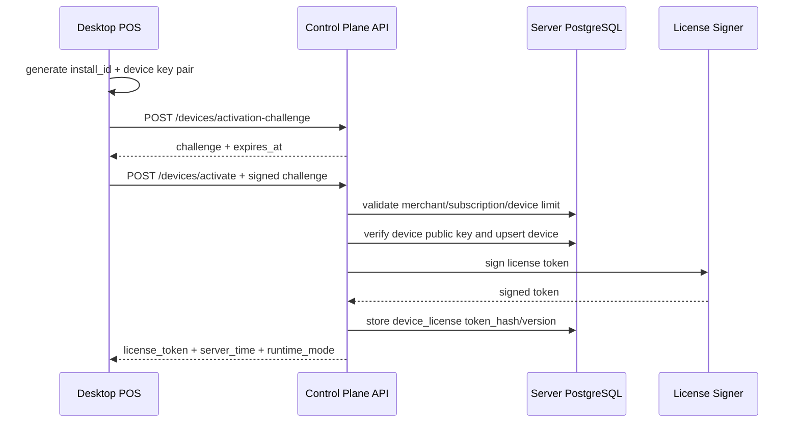
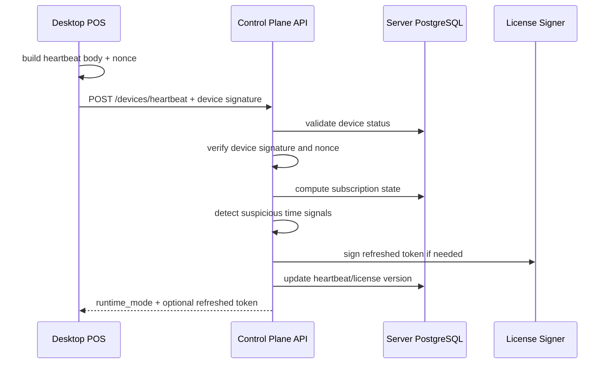
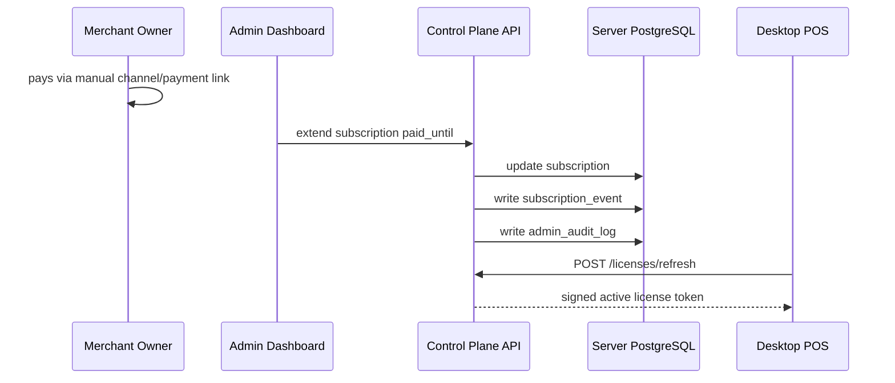
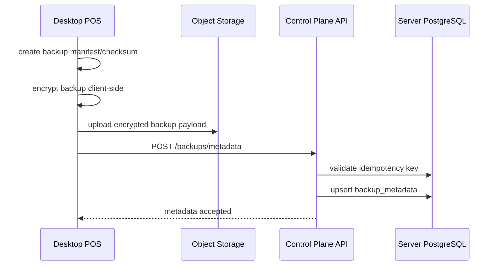
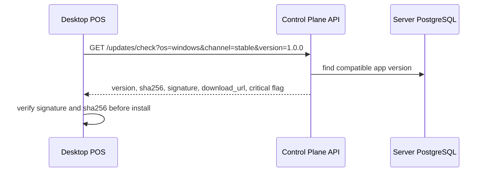

# SERVER API WORKFLOWS

Project: Aplikasi POS SaaS Indonesia - Server Control Plane  
Purpose: Workflow API server yang matching dengan desktop POS local-first.

## 1. Endpoint Groups

Base path:

```text
/api/v1
```

Groups:

- `/auth/*`
- `/merchants/*`
- `/devices/*`
- `/licenses/*`
- `/subscriptions/*`
- `/updates/*`
- `/backups/*`
- `/support/*`
- `/admin/*`

## 2. Device Activation



Rules:

- Activation requires active or grace subscription unless admin override exists.
- Device count must obey plan.
- Response must include server_time for local anti-clock-rollback.
- Activation must bind license to `install_id_hash` and `device_public_key_thumbprint`.
- Device private key must not leave the desktop.
- Repeated activation request must be idempotent.

## 3. Heartbeat and License Refresh



Runtime modes:

- active
- grace
- restricted_expired
- revoked
- suspicious_time

Heartbeat rules:

- Server rejects replayed nonce.
- Server rejects request signed by unknown device key.
- Server derives merchant/device context from verified binding.
- Server may return same token if no state change is required.

## 4. Manual Renewal MVP



Rules:

- Duplicate renewal event must not double-extend subscription.
- Every manual mutation requires admin reason.
- High-risk billing mutation requires admin MFA step-up.
- Desktop exits Restricted Expired Mode only after receiving valid signed token.

## 5. Backup Metadata Upload



Rules:

- API metadata endpoint must not accept database dump payload.
- Cloud backup must be encrypted before upload.
- Server stores checksum, size, status, storage logical ref, and compatibility info only.
- Managed cloud upload must use short-lived pre-signed URL with content length and checksum constraints.
- BYOS validation must block SSRF targets.

## 6. Update Check



## 7. Idempotency Rules

Mutating endpoints requiring `Idempotency-Key`:

- `POST /devices/activate`
- `POST /licenses/refresh`
- `POST /subscriptions/manual-renewal`
- `POST /backups/metadata`
- `POST /updates/publish`
- `POST /admin/devices/{id}/revoke`

Behavior:

- Same key + same payload returns same result.
- Same key + different payload returns `IDEMPOTENCY_CONFLICT`.
- Processing failures are safe to retry.
- Idempotency record must store request hash and response.
- Same key processing must use transaction lock or equivalent race protection.

## 8. Authorization Rules

Server must protect against object-level authorization failures:

- Do not trust `merchant_id` from request body.
- Resolve tenant from session/device binding.
- Every object id lookup must include tenant scope.
- Admin cross-tenant access requires role, reason, and audit log.
- Response DTOs must be allowlisted to prevent object property exposure.

## 9. API Acceptance Criteria

- All server responses include `server_time`.
- All mutating retryable endpoints support idempotency.
- Tenant scope is enforced on every merchant-owned resource.
- Runtime mode returned by server matches `LICENSE_LIFECYCLE.md`.
- API never requires checkout data before allowing local checkout.
- API contract is compatible with `API_SPEC.md`.
- Device-bound license prevents token copy to another PC.
- BYOS validation cannot reach private/internal network resources.
